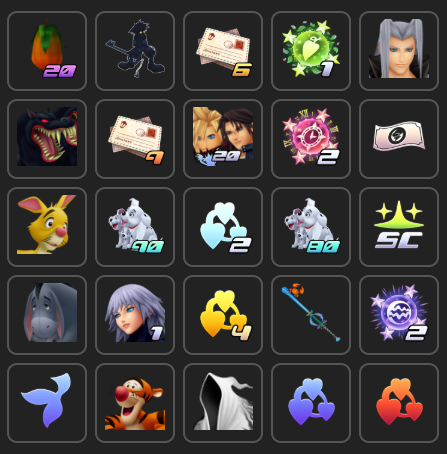
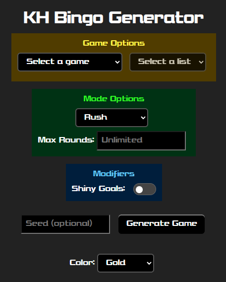
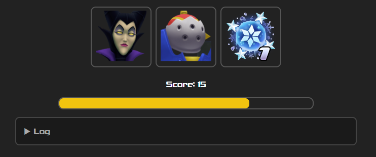
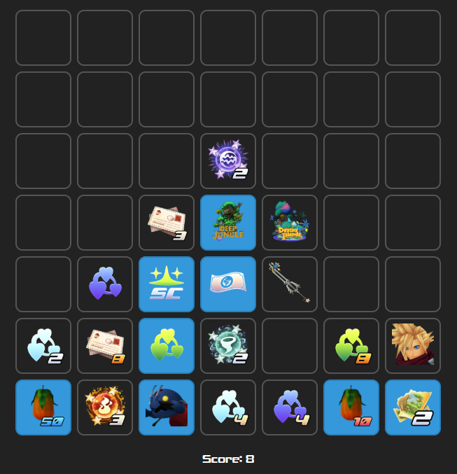
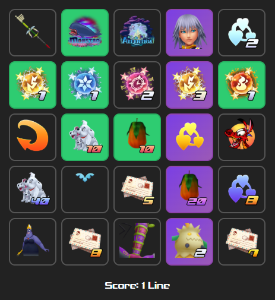
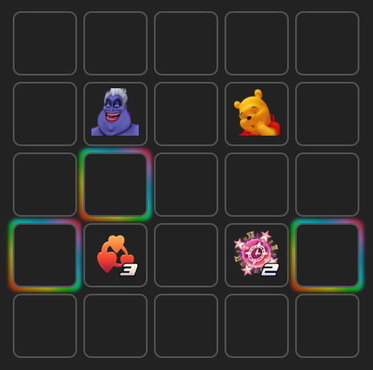
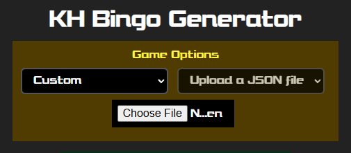

# Kingdom Hearts Bingo Generator

Bingo generator for various Kingdom Hearts games.

[https://cj-2123.github.io/kh-bingo-generator/](https://cj-2123.github.io/kh-bingo-generator/)



# Instructions



**How to Play**

1. Select a game, then select an objective list from the dropdown menus
   1. Some lists have filter tags. If you uncheck them, objectives with that tag won't show up on the board.
   2. "List Preview" will appear when a list is selected, showing how many objectives are in the list and whether or not it has icons
2. Select a bingo mode and set applicable options
3. (Optional) Enter a seed
4. Click "Generate Game"
5. A random seed will be generated if you didn't enter a seed, otherwise the seed you entered will be displayed as the current seed.
   1. "Copy Game Link" will save the game, settings, and seed to your clipboard to share with others.
6. Click "Start Game" to display the board

**Controls:**

- Left click completes a goal. Right click "marks" it
- Scroll wheel up and down cycles through default, marked, and complete
- (Rush Mode Only) Hotkeys: 1, 2, 3
- Color dropdown selects your marking color. It will automatically update if changed mid-game.

For using your own list, see the "Custom Bingo Lists" section.

# Overview of Features

This board supports multiple Kingdom Hearts games with a variety of board types and features.

## Goal Lists

- Kingdom Hearts 1
  - AP Randomizer
    - tags: Atlantica, 100 Acre Wood, Hades Cup, Superboss
- Kingdom Hearts 2
  - Generic
    - tags: Finite Goals
  - Worlds
  - Visits
  - Boss Hunter

Full bingo lists: https://cj-2123.github.io/docs/bingo.html

## Bingo Board Types

### Rush



Complete 1 of 3 goals given to you. After completing a goal, 3 more goals appear.

- The goal you chose and the 2 goals you didn't choose will not show up again.
- If there are less than 3 goals left, the final 1 or 2 will be shown.
- "Max Rounds" determines how many rounds you will play. The default is to play until the entire objective list shows up.
- Score keeps track of how many rounds you've completed.
- Log keeps track of which goals show up and which one was chosen.

Based on Rush Bingo Mode by DotoPotato: [Lockout.Live](https://beta.lockout.live/)

### Fog of War

Select squares are revealed initially while the rest of the board is hidden. Complete a goal to reveal the squares to the top, bottom, left, and right.

- Score keeps track of how many goals you've completed.

**Starting Squares Options:**

- Classic-2 picks the top left and bottom right of the center square.
- Classic-4 picks the top left, top right, bottom left, and bottom right of the center square.
- Center picks the center square only.
- Corners picks the 4 corners of the board.
- Ascend picks the bottom row of the board.
- River picks the left-most column of the board.



### Bingo

Classic Bingo Mode. Given a board, complete a line to get a bingo.

- Squares change color when they are part of a bingo line.
- Score keeps track of how many bingo lines you've completed.



### Modifiers

**Shiny Goals**

- If enabled, will set random squares to "Shiny". You can set how many show up in the Shiny Count text box. If left blank, a default number of shiny goals will appear.
- Based on Shiny Goals by DotoPotato: [Lockout.Live](https://beta.lockout.live/)



# Custom Bingo Lists



**How to use custom bingo lists:**

1. Select "Custom" for Game. A file chooser will appear.
2. Click "Choose File" and select your .json list
   1. You will receive a popup message if your json file is invalid
3. Set your settings to whatever you like
4. Click the "Generate Game" button to generate a board from your goal list

**Requirements**

The .json file must be formatted as follows:

```json
[
  { "name": "Objective 1" },
  { "name": "Objective 2" },
  { "name": "Objective 3" },
  { "name": "Objective 4" },
  { "name": "Objective 5" },
  { "name": "Objective 6" },
  { "name": "Objective 7" },
  { "name": "Objective 8" },
  { "name": "Objective 9" },
  { "name": "Objective 10" },
  { "name": "Objective 11" },
  { "name": "Objective 12" },
  { "name": "Objective 13" },
  { "name": "Objective 14" },
  { "name": "Objective 15" },
  { "name": "Objective 16" },
  { "name": "Objective 17" },
  { "name": "Objective 18" },
  { "name": "Objective 19" },
  { "name": "Objective 20" },
  { "name": "Objective 21" },
  { "name": "Objective 22" },
  { "name": "Objective 23" },
  { "name": "Objective 24" },
  { "name": "Objective 25" }
]
```

The list must have a "name" property for each objective. "icon" is optional. Custom icons are not supported yet, but icons already on the website are useable in custom lists.
[This folder](https://github.com/CJ-2123/kh-bingo-generator/tree/main/icons) contains all of the icons on the site.

```json
[
  {
    "name": "Objective 1",
    "icon": "icons/kh1-ap/Clayton.webp"
  },
  {
    "name": "Objective 2",
    "icon": "icons/kh2-bunter/ShanYu.webp"
  }
  // more goals here
]
```

# Credits

Icons from [https://www.khwiki.com](https://www.khwiki.com/) and [https://televo.github.io/kingdom-hearts-recollection/](https://televo.github.io/kingdom-hearts-recollection/)

Based on:

- [Lockout.Live](https://beta.lockout.live/) by DotoPotato
- [Hollow Knight Exploration Bingo](https://butchie1331.github.io/hk-exploration-bingo) by butchie1331 and the Hollow Knight speedrun community
- [Breath of the Wild Bingo](https://lepelog.github.io/botw-bingo) by lepelog
- https://cj-2123.github.io/kh2-exploration-bingo/ - old KH bingo generator
